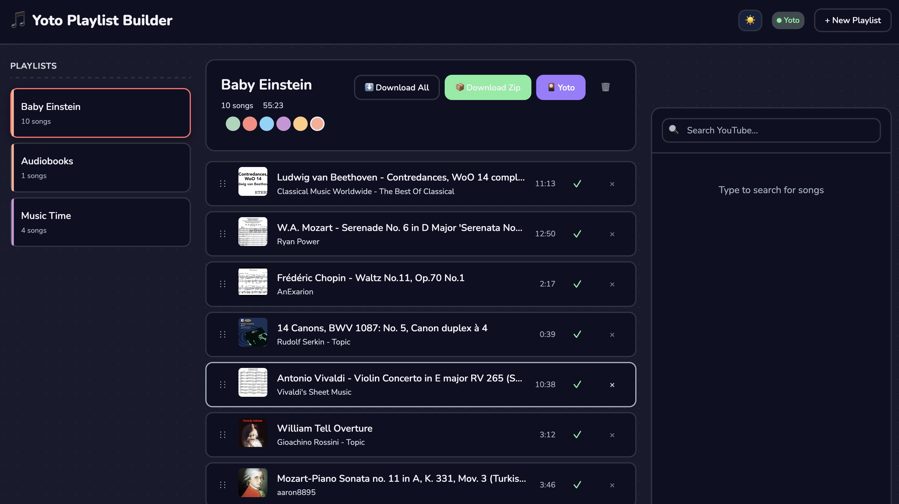

# Yoto Playlist Builder



A web app for building playlists from YouTube and uploading them to Yoto MYO cards.

## Features

- Search YouTube and add songs to playlists
- Download audio from YouTube (via yt-dlp)
- Drag-and-drop reordering
- Upload playlists directly to Yoto as MYO cards
- Dark mode

## Setup

```bash
pnpm install
```

### Yoto Integration (optional)

To upload to Yoto, add your credentials to `.env`:

```
YOTO_TOKEN=your_token_here
YOTO_USER_ID=your_user_id
```

Get these from the Network tab in browser dev tools when logged into my.yotoplay.com.

### Requirements

- Node.js 18+
- [yt-dlp](https://github.com/yt-dlp/yt-dlp) installed and in PATH

## Run

```bash
pnpm run dev
```

- Client: http://localhost:3000
- Server: http://localhost:3001

## License

MIT
